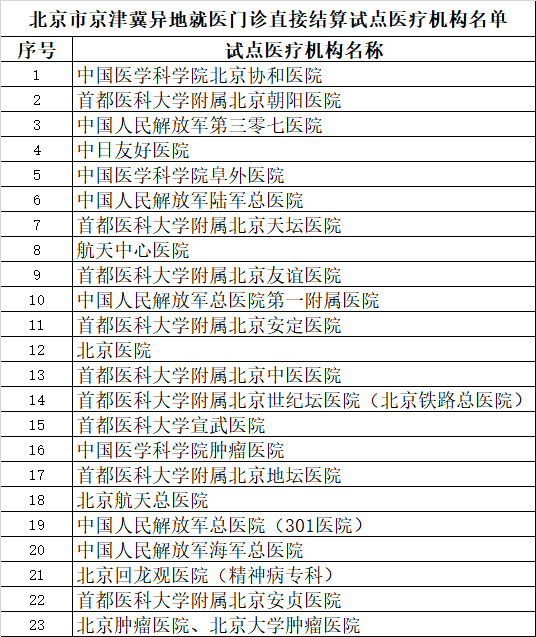
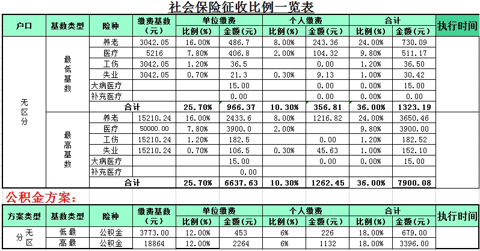

昨天去了趟医院，这也是我最后一月享受北京医保的福利，所以大夫把药和下次的检查的单子全都开出来了，总计3200+，医保报销两千多，我个人支付一千多点。接下来值得考虑的的问题就是，以后自己给自己打工了，我应该怎么做才能把就医成本压到最低。庆幸的是，我家属于京津冀片区，今年年初北京的大小医院开始对京津冀区域跨省异地医保有了改革，所以今天做下调研，顺便记录一下。

<!--more-->

## 一个不算完整的京津冀异地门诊直接结算的表

这个表并不完整，详情请见相关资料《关于公布北京市第n批开通跨省异地就医...的通知》。

如果想看天津、河北的表(可能也不完整)，这里有一个连接：[186家！京津冀异地就医门诊直接结算试点医疗机构名单发布](http://hebei.hebnews.cn/2020-12/09/content_8251120.htm)

## 备案、挂号、门诊、缴费、报销

使用京津冀异地医保门诊就医，在流程上还是和在京职工医保有所不同的。职工医保只要你在职，去自助缴款机器上就可以插卡挂号取号，各种检查买药缴费。  

1. 异地医保首先要去备案，微信小程序：河北省/天津？异地就医备案平台，选择自己的参保地，然后备案；我在致电天津的医保局时候，他说需要符合条件，这个我还没有调研。
2. 挂号就是就是正常网上预约，但是取号的时候需要去窗口去，我咨询的那个医院一再强调，**所有的业务都去窗口**，那个自助机是给北京医保和自费用的。
3. 接上条，这次京津冀医保一体化最大的好处就是门诊可以报销了，**报销的比例是按照你的参保所在城市为准**，哪类药物和检查可以抵扣是按北京医院的标准走。
4. 我咨询的那个医院和我说，我们这种异地医保，有一个专门的窗口处理这个事儿  
  
以上这些信息，都是我在北京的相关网站和医院搜集来的，保证准确。但是令人遗憾的是，我在我家这边去核实这些政策，他们表示不知情，对于这种情况我已经习惯了。

## 医保的选择

像我如果想在我家这边交医保，有如下几种选择：
1. 我在我自己的公司缴社保：这种方式通用性最强，就是我们常说的城镇职工医保，缴费细则如下图。这种方式缴纳的社保，800块开始报销，报销比例为85%。

2. 灵活就业社保：这种方式仅交养老和医保，但灵活就业限制你的户口必须在当地（2021年07月24日：最新的政策好像是不需要了，不知道落地了没），灵活度不如职工社保，因为不需要交额外三险，所以这种社保成本比职工社保稍低一点，医保报销比例和职工医保一致。

3. 居民个人医保：每年年尾缴纳280块(低档)，有的地方是1200开始报销，有的地方是500开始，报销比例50%。  
2021年09月18日：需要注意下，这个居民城乡医保**不能在三甲医院门诊和绝大多数的二甲医院门诊使用**，只有一级医院门诊或各个级别医院住院能享受，具体还看当地政策。（一级医院一般是村卫生所或社区卫生院）。

## 相关资料
[北京医疗保障局·提问标题： 京津冀异地门诊直接结算](http://www.beijing.gov.cn/hudong/yonghu/static/ybj/zixun/detail.html?searchCode=sybj16092133138701364775)  

[北京医疗保障局·关于公布北京市第四批开通跨省异地就医普通门（急）诊 直接结算业务试点定点医疗机构名单的通知](http://ybj.beijing.gov.cn/swdt/2020_tzgg/202101/t20210115_2220983.html)  

[北京医疗保障局·关于公布北京市第三批开通跨省异地就医普通门（急）诊 直接结算业务试点定点医疗机构名单的通知](http://ybj.beijing.gov.cn/swdt/2020_tzgg/202011/t20201127_2152484.html)  

[北京医疗保障局·关于公布北京市第二批开通京津冀异地就医普通门（急）诊直接结算业务试点定点医疗机构名单的通知](http://ybj.beijing.gov.cn/swdt/2020_tzgg/202010/t20201009_2106527.html)  

[北京医疗保障局·关于公布北京市首批开通京津冀异地就医普通门（急）诊直接结算业务试点定点医疗机构名单的通知](http://ybj.beijing.gov.cn/swdt/2020_tzgg/202007/t20200730_1966537.html)  

[知乎·河北的医保卡如何能在北京看门诊？](https://www.zhihu.com/question/412163927)  
