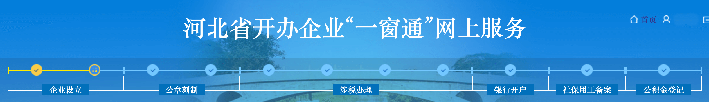
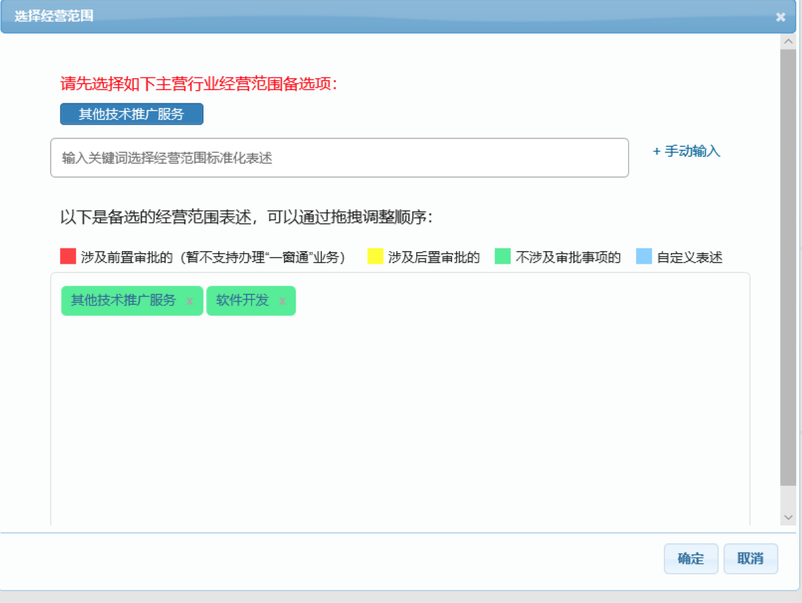
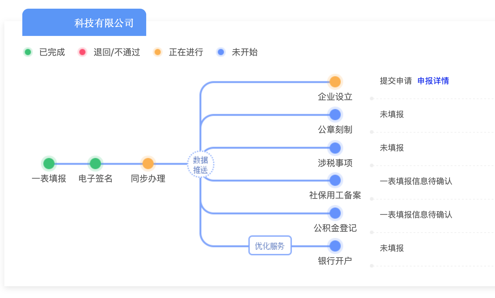

昨天，也就是7月20号，我真正的启动了自己的创业计划。说是创业，其实我只是需要一个营业执照和对公账户，因为目前有业务和不算太多的现金流，所以这个公司实体对我来说只是个工具罢了。由于我的主要收入是腾讯、小米的广告费，所以需要一个小规模纳税人的实体。注册一个公司的第一步就是去审批局（原来的工商局）把营业执照搞到手，这也是我这篇文章所讲的内容。

<!--more-->

## 行动之前

首先需要想好要注册公司的地址，这些包括：注册在哪个片区、你的注册地址是住宅还是商务写字楼。  

a. 注册在哪个片区，哪个片区的审批局就会管你，以后就去对应片区的税务局报税。我注册在家里，也就没得挑了。  

b. 像我就把公司注册在家里，家里大概率就是住宅了，如果是住宅性质的话在提交资料的时候需要提交一个承诺书，承诺把这个房子改为商用。这个承诺书一般你所在片区的审批局都会提供，去那拿一张就好了。

c. 建议：法人额外办一张手机卡，公司相关的所有联系方式都用的这个号码。因为公司审批通过后，会有非常多的记账公司给你打电话，很烦。

## 三个人（法人、监事、财务负责人）

我之前在网上搜，注册一个市面上常见的有限公司，最少需要两个人：法人和监事。__这是不对的__，我先说一般情况。市面上常见的玩法是“有限责任公司(自然人投资或控股)”，这种类型的企业最少有三个角色（不能兼职），法人、监事、财务负责人；如果找财务事务所或财务公司代理你司的财税，这个财务负责人有可能是财务公司提供，但这种一般价格不便宜，而且很少，大多都是代记账。代记账只是帮里打理下账务问题，没有太多法律责任，出了问题还是财务负责人背锅。

## 启动！

百度搜XX市市场管理局，一般来说里面会有一个很大的图，叫网上办事大厅。点进去之后会有网上注册企业的入口，很多地方叫“一窗通”。说下我自己的感想，线上办业务真是不错，尤其是对于我这种电脑玩的转的人，真的不喜欢去窗口排队，虽说这个系统所用的技术略显落后，但是已经能解决90%的问题了，给政府点个赞。  

注：需要IE或者360这类浏览器，Mac的Safari不好使

### 所需的资料

照片要保证清晰，图片方向是正确的，不要搞成90°和180°的，文件大小在1M以内，下面就不赘述了。

1. 三个人的身份证正反面照片。

2. 租赁合同照片。如果是租的注册地，需要注册地的房屋租赁合同照片，业主和全体股东签字、按手印。注意如果业主也是股东的话，承租方里面也需要有该股东的的签字和手印，我就是因为这个事儿打回了两次。

3. 业主房产证照片。

4. 住改商承诺书照片。如果你注册地是住宅，就是需要住改商承诺书，上面的地址填房产证上的地址，最后法人签字，按手印。

### 注册

三个人注册证照签和企业一窗通。  

证照签是用来给一窗通里所有合同签名用的，学名叫CA。  

企业一窗通：用来填写注册企业信息的网站，每次提交之前需要三个人签名，用证照签扫码。

### 核准名称

先想公司叫什么，一般来说就是你所在市+字号+行业表述+组织形式。如果是所在省或者中国开头，需要审批，一般没人这么搞。  

这个可能重复风险的黄色提示条，有的地方会卡你，让你改名，有的地方不会，我的就过了，建议先忽略。  

后面这个行业表述需要注意，这个和你主营业务强关联的，比如我选科技，那么填经营范围的时候，他指定的主营一定是第一项。但是科技这个很特殊，它属于M大项里面，但是我打电话问过，我想用软件开发作为主营业务，但是名字想用科技有限公司，这个是可以的。在填写的时候，按照系统的提示，其他技术推广服务写在第一位，接下来是软件开发，接下来就是其他的，下来营业执照之前，工作人员会帮你把这个修改好，软件开发作为主营业务，但公司名不变。  

组织形式看你需要了，大多数玩法就是有限公司，建议先学习一下这几个选项的区别。

登记机关就是你注册地的审批局，选好公司名字和登记机关，就可以下一步了。

### 填写企业设立

这部分大多数都是填个人信息、注册地信息、股东信息之类的，不在此赘述。不过其中有几个我遇到的问题，我简单说下：

1. 住所产权选什么？  
建议选租赁，租赁是大多数人的玩法，坑比较少；即使是你自己家的房子也选租赁，把自家的房子租给公司，这样业主需要去税务局代开一张发票，公司可以凭借这张发票把公账上的钱转出来，来支付租金。自有的意思是房子的产权是公司的（这个好像很容易理解错，但是两个会计都是这么和我说的）；无偿使用就是没有租金。但是自有和无偿使用都需要交房产税和土地税，按房屋原值算（也有说按面积算的）。

2. 经营期限  
一般写十年，到期后要重新提供租赁协议，换营业执照，对公账户暂停重新激活。

3. 经营范围  
这个我在前文已经提及，这里就上一张图吧。如果像我一样做手机软件的，收入是软件的广告费，那么需要在手动输入里加入“设计、制作、代理、发布国内各类广告”（人家让我这样改的，我觉得这块比较灵活，之前北京的老东家直接加了一个广告业大项）  

4. 股东的认缴和实缴  
仅填认缴即可，实缴可以空着

5. 其他资料上传  
对我来说，房产证照片、带手印的租赁合同照片、住改商承诺书

6. 除了企业设立和社保公积金项目，都可以选本次不同步，跳过项目

7. 2021年08月02日：**注册资本别写太少**，像我写了一万，一些银行都不乐意给我开对公账户，怎么也写个五万十万的

### 等待审批

提交之后就是三个人的签名，用证照签扫码。扫完码之后提交到审批局，然后等通过或者打回。每次打回人家都给了非常具体的修改意见，看不明白打电话问就可以了，算上拿照，审批局跑三次足矣。  
  

审批通过后，建议打个电话问下多久取营业执照，我这边是两天后，可能也有更快的地方。

## 完成，准备刻章

下一篇文章讲下刻章的流程。

