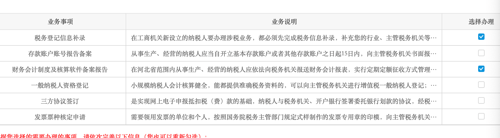

刻完章可以选择对公开户或税务登记，这两者是不冲突的。如果先对公开户的话，税务登记可以一次跑完；如果先税务登记，那么一些信息是登记不上的，比如对公账户账号、三方协议，开完户需要再填上这些。那我为什么先税务登记了呢，因为我想开户的银行说要先去税务登记，他们会看一下登记的信息，我没办法，只能先登记。

<!--more-->

## 线上登记

登记的话需要先线上登记，状态变成办理中，然后线下审核信息，盖章之类的。在我们这儿，税务局窗口是一定要跑的。  

需要线上登记的项目：电子税务局的“新办纳税人综合套餐申请”，法人、记账和财务负责人的手机税务APP注册

线上登记我参考的是这篇资料，[新办企业如何在电子税务局注册并办理税务登记？](https://jingyan.baidu.com/article/03b2f78c5b5b901fa237aea3.html)

## 注册

注册这块有我遇到了两个小坑：  

网页端的电子税务局是有注册功能的，但是你填完所有信息后提交，会提示会话失效，根本注册不了，换Safari和Edge都不好使，我细瞅了瞅，应该是跨域cookie存不上，我没折腾我本地环境，直接换移动端注册。  

移动端一定要用装有你平时用支付宝的手机，因为中间需要人脸识别，走的是支付宝的接口，我用公司的办公手机，第一天就识别不过，而且一天识别5次不过当天就不能再尝试了。  

移动端注册完，网页端就可以用移动端扫码登录了。

## 填报信息

我看到的填报系统和参考资料的示意图不太一样，但该有的都有。  

选“新办纳税人综合套餐申请”，如果是法人登录，直接就能显示需要登记的企业，点击去完成。  

有几项不是很懂：

核算方式：独立核算（非独立核算一般是分支机构，总公司统一核算，独立核算统负盈亏应该是非盈利企业，医院一类的，这句话是一个老会计和我说的，没有验证）  

使用会计制度：小企业会计制度  

总分机构类型：非总分机构

财务会计制度及核算软件备案报告，这一栏对于我来说全部默认就行，因为我没有库存，也就不涉及移动加权平均和全月一次性平均。据说如果有库存，全月一次性平均对会计更方便。  

办理的业务只选两个，税务登记信息补录、财务会计制度及核算软件备案报告；如果开了对公账户的话，还需要勾选存款账户账号报告备案、三方协议签订；如果需要领发票，还需要发票票种核定申请（我的一般开专票，去税务局代开，所以这个不需要勾，如果以后需要增加票种，可以以后再申请）。

  
  
2021年10月22日：如果代记账的话，尽量不要把财务电话写代记账的电话，因为这样会在核定票种增加增值税专票的时候，触发税务系统的风险提示。有了风险，税务专员会让你去解释为啥这个电话既在你的公司财务身上登记了，又在别人公司财务登记了，然而这两个人又不是一个人。只有解除了风险，才能在窗口核定多一点的专票份数。你可能会说我一直代开专票，就不会有事儿，目前来看是的，但是现在在推广增值税电子专票，以后开纸质专票很可能就逐步淘汰了，票种核定这一关是躲不过去的，所以说还是不要给自己找麻烦。

## 线下审核

需要准备的资料：营业执照；法人、财务负责人、代记账（可能和财务负责人是一个人）的身份证原件和每个人的一份复印件（复印件可能不需要）；所有的章。

去对应片区的税务大厅，门口排号机会有人问你办什么，税务登记的话他就会问你电子税务局和APP的信息注册了么，没注册先去注册。  

到窗口其实也没做什么，大致就是核对信息、盖章、签字。最后就是给一张表，上面有你公司所有要报的税，我这个科技公司有10项。

## 后续的对公账户备案和签订三方协议

这些都不需要跑线下了，电子税务局上填报即可。  

注：下一篇是对公开户，开完户才是后续的税务登记（下）。