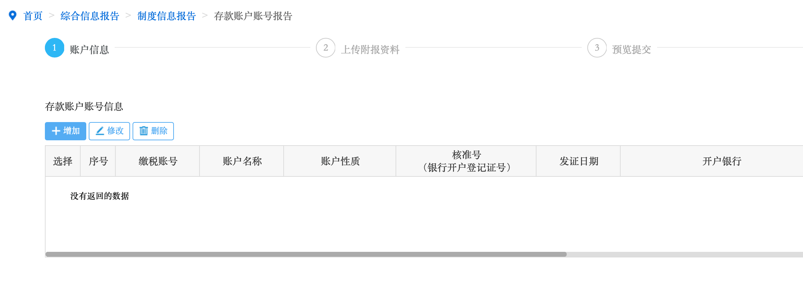

跌跌撞撞开完了对公账户，如果没有什么特殊情况，就可以完成税务登记里面剩下的存款账户账号备案和签订三方协议了，这两项都可以在电子税务局处理。

<!--more-->

## 存款账户账号备案

  

我们开的是基本户，也就是公司第一个账户，按照银行给的基本存款账户信息单填上就完成了。

## 签订三方协议

三方协议就是税库银三方协议，看完上面的协议，点提交就可以了。不知道为啥，旁边的签名点完了网页报404，我打电话咨询了下客服，人家说不需要签名，直接提交就可以签订成功。