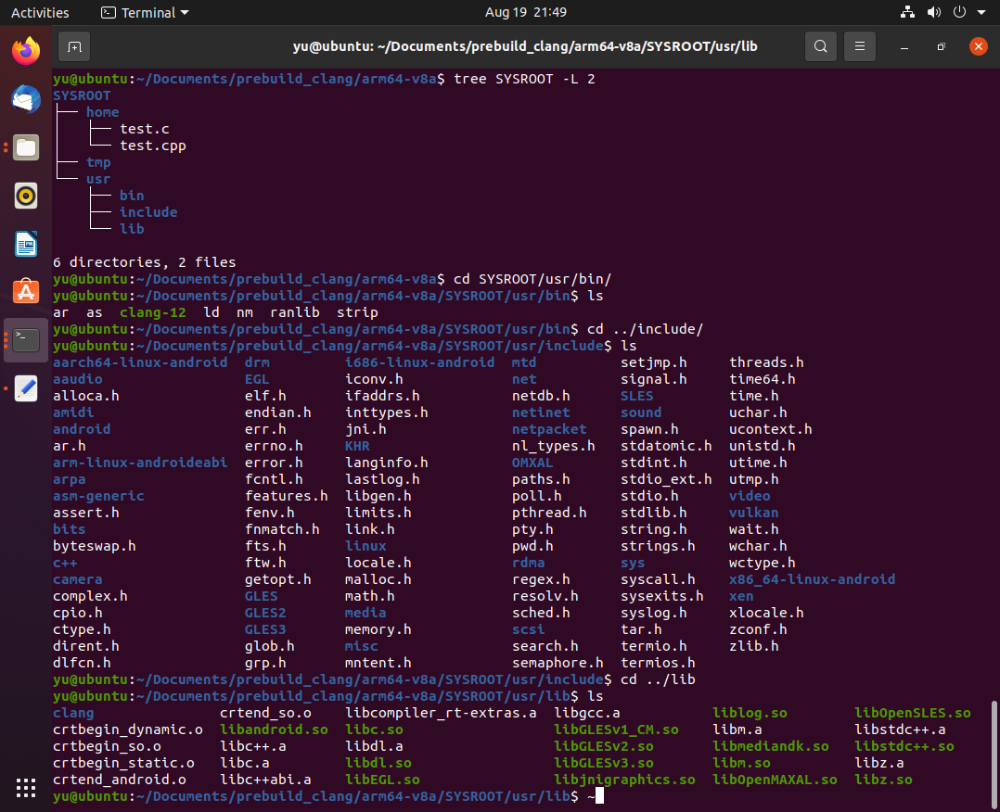

用的前一篇的内容编译出的clang没有问题，但是使用生成的clang编译c/c++程序，仅仅靠前面的步骤还不行。倒不是编译出来的clang-12不好使，只不过是缺少其他的库和头文件。

<!--more-->


## 编译clang，libcxx，libcxxabi

```
# 交叉编译Android平台需要指定-ldl
export LDFLAGS="-ldl"

# 配置
cmake -S llvm -B build_arm64 -G Ninja \
-DLLVM_ENABLE_PROJECTS="clang;libcxx;libcxxabi" \
-DCMAKE_BUILD_TYPE=MinSizeRel \
-DCMAKE_C_FLAGS="-Os" \
-DCMAKE_CXX_FLAGS="-Os" \
-DCMAKE_SYSTEM_NAME=Android \
-DCMAKE_SYSTEM_VERSION=21 \
-DCMAKE_ANDROID_ARCH_ABI=arm64-v8a \
-DCMAKE_ANDROID_NDK=/home/yu/Desktop/android-ndk-r21e \
-DLLVM_DEFAULT_TARGET_TRIPLE=aarch64-unknown-linux-android

# 编译
cmake --build build_arm64

# 安装
cmake --install build_arm64/ --prefix clang_install_arm64/

```


## 在-v中加入自己的信息

这一步是可选的，只是我自己的一些想法，简单记录下。  

/llvm-project/clang/lib/Driver.cpp Driver::PrintVersion  

这里可以加一些自己的编译信息。  


## 组装一个工具链



1. NDK/sysroot/usr/include
2. NDK/platforms/android-21/arch-arm64/usr/lib
3. ~~找一份aarch64的binutils(as/ar/ld/...)放到bin目录下~~
4. 找一份aarch64的libgcc.a放到lib目录下
5. ~~llvm-project-12/test_install/bin/clang-12放到bin下面~~
6. llvm-project-12/test_install/lib/clang目录整个放到lib下面
7. llvm-project-12/test_install/lib/libc++和libc++abi放到lib下面
8. llvm-project-12/test_install/include/c++整个目录放到include下面
  
2021年09月06日：Android Target>=30已经没有办法在files文件夹执行了，选择使用jniLibs放可执行文件方案。

注意：  
* 在测试编译的时候会提示找不到asm/sigcontext.h这个头文件，或者这个目录的其他文件，这个文件在ndk/sysroot/对应架构/asm下，在用Android平台的clang测试编译的时候记得include这个路径进去。
* 找不到iostream，需要将c++/v1这个路径include进去。
* 需要找的binutil和libgcc.a可以去github上搜，也可以拆一下别人的什么手机代码运行软件啊，里面肯定有，当然正解是自己编一下gcc。


## 尝试在Android运行

### 给予可执行权限
```
chmod.add("/data/data/com.example.clang/files/SYSROOT/usr/bin/clang-12");
chmod.add("/data/data/com.example.clang/files/SYSROOT/usr/bin/ld");
chmod.add("/data/data/com.example.clang/files/SYSROOT/usr/bin/ar");
chmod.add("/data/data/com.example.clang/files/SYSROOT/usr/bin/as");
```

* 涉及到的可执行文件需要给可执行权限，这里偷懒直接777了。  


### 环境变量
```
PATH=/data/data/com.example.clang/files/SYSROOT/usr/bin:" + System.getenv("PATH")
TEMP=/data/data/com.example.clang/files/SYSROOT/tmp
```

* TEMP是一定要有的，不然clang会尝试使用/tmp或/usr/tmp

### 编译命令
```
/data/data/com.example.clang/files/SYSROOT/usr/bin/clang-12 \
/data/data/com.example.clang/files/SYSROOT/home/test.cpp \
-I /data/data/com.example.clang/files/SYSROOT/usr/include \
-I /data/data/com.example.clang/files/SYSROOT/usr/include/aarch64-linux-android \
-I /data/data/com.example.clang/files/SYSROOT/usr/include/c++/v1 \
-o /data/data/com.example.clang/files/SYSROOT/home/test \
-v \
-Xlinker -lc++ -lc++abi
```

* -v 显示编译过程
* -Xlinker 传递参数给链接器


## 其他需要说的

* 在编译libcxx的时候，需要导入LDFLAGS="-ldl"环境变量，实际上也可以通过cmake参数的形式(-DCMAKE_XXX_XXX)传递进去，但是cmake的LINKER_FLAGS足足有四个，我也不知道该配置哪个，就用了环境变量的方法。
    ```
    CMAKE_EXE_LINKER_FLAGS
    CMAKE_MODULE_LINKER_FLAGS
    CMAKE_SHARED_LINKER_FLAGS
    CMAKE_STATIC_LINKER_FLAGS
    ```
* libc++和libc++abi是clang对c++标准的一套实现，与之对应是libstdc++(gcc的实现)。其中libc++包含大部分标准库函数实现，libc++abi包含关键字功能实现。如果在测试的时候提示找不到 std::__1::cout ，就是没有链接libc++.a；出现未定义 operator delete(void*) 则是没有链接libc++abi.a。

* 编译出来的clang-12生成了clang和clang++两个软连接，实际上执行的时候直接用clang-12就可以了，clang编译器会根据后缀名自己判断是c语言还是c++，当然也可以通过-x手动指定编译哪种语言。如果你真的想用软连接，不要用编译生成的软连接，自己在Android环境里自己 ln -s 手动创建，否则会出现clang不接收其他参数的问题，提示no input file。