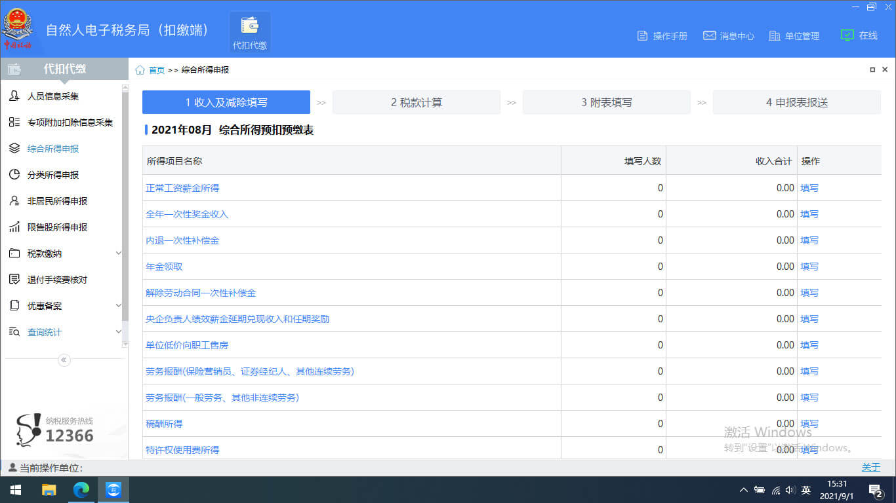

今天税务的同学联系我，说今天可以申报上个月的个税，让我配合下。既然是零申报，我想肯定不复杂，征求了税务同学的意见，自己试了试。

<!--more-->

## 企业为员工申报个税信息

当我知道要申报**个人所得税**的时候，我还是挺疑惑的。正常个税不都是每个员工每年用个人所得税APP进行年度汇算嘛，和企业有什么关系？实际上企业每个月都需要为员工申报工资所得、五险一金减免等等的税务信息，这些信息最后会汇总到国税局，每年年初的时候每个人进行的年度汇算，多退少补的金额就是根据企业每月的申报的数据计算出来的。  

## 参考资料

[个税零申报 自然人电子税务局 申报教程](https://jingyan.baidu.com/article/ed15cb1b2c2c285ae36981b7.html)。现在软件好像支持各个地区的申报了，大部分地区都是用一个软件。

## 软件准备和登录

[自然人电子税务局（扣缴端）](https://etax.chinatax.gov.cn/webstatic/download-service/100001)：在自然人电子税务局 → 下载服务 → 软件工具里面。  

登录的时候使用法人的个人所得税APP的账号密码登录，教程上使用申报密码登录，这个申报密码不支持首次登录，需要去网页端自己改一下才能用。  

## 简单流程说明

1. 人员信息采集。把法人录进去就可以了，从业开始时间是第一次申报的上个月，保存，报送。
2. 综合所得申报。正常薪金所得，向导里面生成零工资记录，税款计算计算下，申报表报送，申报。
3. 显示申报成功，无需缴款

## 注意事项

这个企业个税申报每月1-15号申报，不要忘记了。软件的数据好多都是存本地的，换电脑需要重新导入。

