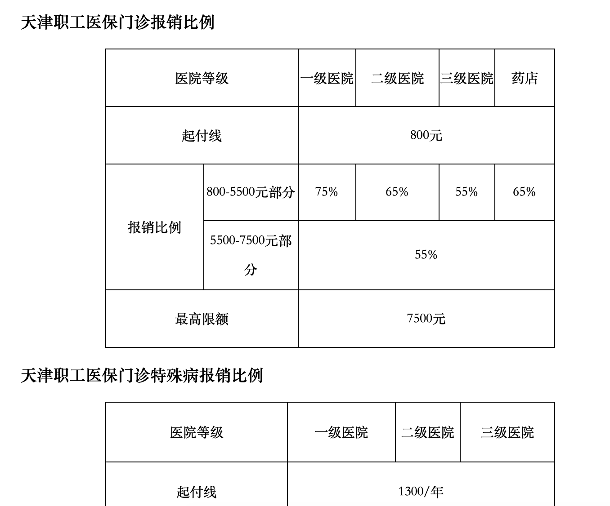

之前对城乡居民医保理解的有问题，昨天跑了趟街道社区，工作人员详细的说了说这个医保的细节和性价比，今天记录下。

<!--more-->

## 城乡居民医保的报销范围

**该部分仅适用于2021年的城乡居民医保政策，2022年已经有所调整，详情见2021年10月23日更新**

1. 这个图里需要注意门（急）诊的其他一栏内容，**限一级定点医疗机构和定点药店的门急诊就医购药**。所谓一级医疗机构，大多是社区卫生所、村卫生院这些，然而我们一般去的市中心医院，基本上都是三级或者二级医院，所以这个城乡居民医保，如果你不是住院的话，是享受不到报销的。  
2. 同样需要注意，上面有一个门诊特殊病，如果需要就医的病恰好包含在特殊病种里，是可以报销的。比如说肺心病，糖尿病，癫痫等等。  
  
注：这个城乡居民医保如果首次参加，是需要在所在社区进行进行登记的，登记完就可以在税务APP上缴费了。  
  
2021年10月23日：  
a. [天津市医疗保障局：关于做好2021年城乡居民基本医疗保障工作的通知](http://ylbz.tj.gov.cn/xxgk/zcfg/ybjwj/202109/t20210930_5618549.html)
> 自2022年起，本市居民医保参保人员（以下简称参保人员）在一级、二级和本人选定的1家三级定点医疗机构门（急）诊就医，年度起付标准为600元，最高支付限额为4000元，高档缴费参保人员支付比例分别为55%、55%、50%，低档缴费参保人员支付比例分别为50%、50%、45%。  

b. [天津市医疗保障局：2022年度城乡居民基本医疗保险宣传提纲(见附件)](http://ylbz.tj.gov.cn/xxgk/zcfg/ybjwj/202110/t20211019_5655972.html)

## 职工社保费用、分析、注意事项

职工社保有两个交法，一个就是咱们都知道的公司代缴，每月公司承担12%，个人承担8%，这种一般是五险。第二种就是灵活就业职工医保，也就是俗称的个人缴城镇职工社保。灵活就业的社保可以选择只交养老保险，也可以养老+医疗（实际上还代缴了生育保险）。按照最低工资基数3364元来说，养老保险需要大约670元（3364x20%），医疗保险需要大约290元（3364x8%+），一个月大约960元左右。  

### 如何登记和缴款

1. 登录[天津市人社局网上办事大厅](https://public.hrss.tj.gov.cn/ggfwwt/person/loginHtml)，里面有一个灵活就业人员参保登记，登记下就好。

2. 之后需要登录天津税务APP（因为现在社保都是税务部门代收），在办税标签里面有一项“自然人业务”，没有账号就注册下。登录进去后最后有一个社保缴费办理，这里就可以申报和缴费城镇职工社保了。

注1：[国家税务总局天津电子税务局](https://etax.tianjin.chinatax.gov.cn)在这个网站上自然人登录是等效的，这个是电脑网页版。  

注2：960元具体计算如下表所示：  
  
| 征收项目 | 征收品目 | 征收子目 | 实缴金额 |
| :----: | :----: | :----: | :----: |
| 基本医疗保险费 | 灵活就业人员大额医疗互助保险 | 个人缴费门诊大病医疗 | 33.64 |
| 基本医疗保险费 | 灵活就业人员基本医疗保险 | 个人缴费医疗保险 | 235.48 |
| 企业职工基本养老保险费 | 灵活就业人员基本养老保险 | 个人缴费养老保险 | 672.80 |
| 基本医疗保险费 | 职工大额医疗救助 | 灵活就业人员大额医疗救助 | 22.00 |

### 关于费用的分析

参考资料：[城镇职工医保报销比例](http://wenda.bendibao.com/live/2020624/125558.shtm)

这张图是我从上面的链接截取下来的，有两点需要注意，一个是城镇职工医保也有特殊病的特殊补贴，另一个是正常门诊的起付线和报销上线。  

  
  
我做了两个门槛限额的分析：

1. 在三级医院门诊看病（非特殊病）花多少钱才能达到7500的报销上限，换种说法就是7500的报销额度能如果全部使用，自己需要支付多少。    

    ① 800 + 7500 / 0.55 = 14436元  
    ② 14436 - 7500 = 6936元  
    ③ 6936 + 290 x 12 = 10416元  

    解释①：医保三级医院报销比例是55%，起付线800不报销，那么想要最高抵扣，需要在医院门诊开具14436元的单子，如果没有医保这个钱就是实打实的自己掏  
    解释②：现在有了医保，那么医保抵扣7500，实际仅需要支付6936元  
    解释③：那么算上交12个月医保的成本，一共支付了10416元，实际上医保最多只能报销14436 - 10416 = 4020元

2. 我在三级医院门诊（非特殊病）看病花过多少钱，这个医保才是划算的，有性价比的。

    我们设A为可以走55%抵扣的花销，那么有 290 x 12 + 800 + A x (1 - 0.55) = A + 800，解得A = 6327，等式左边为交医保实际支出，右边为不交医保全额就医的支出，那么在医院至少花 6327 + 800 = 7133元才能享受到真正医保抵扣。
  
当然这只是我对门诊价格的分析，交医保还有其他的规则，比如住院的报销、大病的报销、退休后想享受医保至少需要交15年（有的地方不一样）等。

### 一些注意事项

1. 首次或者断缴三个月以上的医保是需要有6个月的医保等待期的，就是说这六个月不能享受医保待遇。

2. 上面的图我特意多截取了下面一部分，意思是城镇职工也有特殊病的政策，对应就医可以留意下。另外有的地方有基本医保慢性病保险，这个也可以具体问下当地医保局。

3. 办理社保卡需要先交过社保，否则无法办理。
