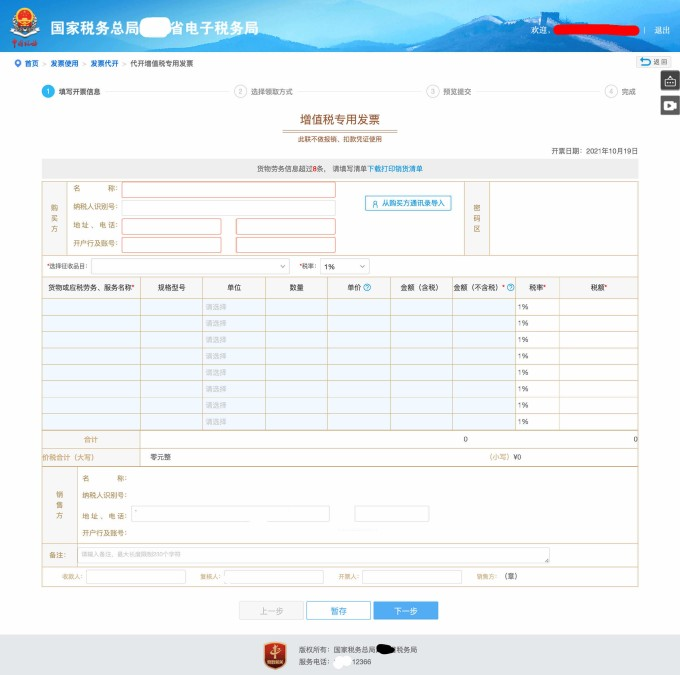

第一个月的收入结算单到了，让提供增值税专用发票，作为小规模纳税人可以通过税务局代开发票，记录下相关的流程和注意事项。
<!--more-->

## 申请开票

1. 登录电子税务局后选择【我要办税】-【发票使用】-【代开发票】-【代开增值税专用发票】
2. 填写开票信息，填写星号信息，其中注意下结算单里的金额是含税还是不含税

3. 选择线下领取，要是邮寄是要邮费的
4. 交税款，点击三方扣款就行，点完钱直接就从对公账户上划走了
5. 这就算完事了，等着去线下取票

## 线下取票

1. 税务局的**增值税发票代开终端**上刷身份证领取，注意自助区有很多种机器，别的机器没办法取代开的发票，别用错了
2. 取到的发票左上位置应该是印有代开的标识，一般来说对方公司只要第二三联，别的都不要，提供给对方的二三联需要在右下角位置加盖发票专用章，注意不要印到金额上

## 关于小规模纳税人代开专票和发票票种核定的问答

**以下问答在2021年10月20日适用，如有政策的更改，以当地税务局为准**

1. 国家税务局的规定是什么？  
按照《国家税务总局关于扩大小规模纳税人自行开具增值税专用发票试点范围等事项的公告》（国家税务总局公告2019年第8号）第一条和《关于<国家税务总局关于扩大小规模纳税人自行开具增值税专用发票试点范围等事项的公告>的解读》第二条，纳入小规模纳税人自行开具增值税专用发票试点范围的小规模纳税人可以选择使用增值税发票管理系统自行开具增值税专用发票，或者向税务机关申请代开。选择自行开具增值税专用发票的小规模纳税人，税务机关不再为其代开。你公司已选择自行开具增值税专用发票，就不能再向税务机关申请代开增值税专用发票。

2. 税务局如何知道你的公司是不是能自己开呢？  
只要你**票种核定里有增值税专用发票**的票种，税务局就认为你要自行开专票了，你就点不开【代开增值税专用发票】的链接了，会出现监控报错。  

3. 那我已经核定了增值税专用发票，但是我诉求还是想税务局代开发票，应该怎么做？  
去窗口把核定的票种删掉，这样就可以点进去【代开增值税专用发票】的链接了，也就是说税务局代开专票和自行开专票二选一，不能同时存在。

4. 票种核定具体是干嘛？  
简单来说，核定了某票种你就可以领取该票种的空白发票了，申请税控（UKey）并购置了发票打印机后，就可以自行开具增值税专用发票了，不用再跑税务局了。对大企业来说，这极大的提高了办税人员的工作效率；但是对我而言，一个月没有几笔收入，没几张发票，税务局代开性价比最高。

## 其他需要注意的事项

1. 真的需要做票种核定的话，增值税专用发票有纸质和电子的两种，如果仅核定4份纸质专票+1份电子专票，一般不会出什么问题，窗口可以直接办理；但是如果申请的份数较多，极有可能触发税务的风险监控，税务专员会让你解释下你这些票准备干嘛，目前电子专票专员盯得还比较紧，使用的还不是那么广泛。所以说，代开专票很大程度上能避免一些税务上的麻烦。

2. 简单了解了下增值税电子专票，开出的电子专票上是没有发票专用章的，全靠电子签名验证票据是否有效，功能和纸质专票等效，也是打印出来保存。
