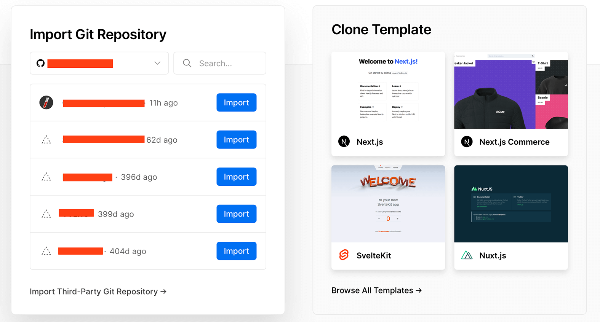

由于Github Pages服务并不稳定，可用率不高，只能作为个人记录的一个玩物。最近了解到Vercel提供了静态页面的托管服务，而且稳定性相当高，因此这两天学习了一下。

<!--more-->

## 基本流程
Vercel提供网站构建、部署、托管的服务，个人用户免费使用。Vercel和Github是强关联，通过授权代码仓库，Vercel就可以拿到指定仓库里的项目代码，使用指定的构建工具，将仓库里的项目构建成静态网站，生成的网站直接部署在Vercel的服务器里，并返回给我们域名。

## 使用方法

### 直接从Github项目导入
不管是自己在本地push了一个Jekyll/Hexo/...项目，还是fork了一个别人的项目都可以。然后在Vercel里NewProject，左侧的Github里就会显示出这个项目，点击import。如果顺利的话，Vercel会自动识别项目类型，使用合适的命令，最后Deploy即可。

### Vercel模板生成新项目后导入
通过CloneTemplate点击生成Jekyll项目，输入项目名后，Github上会生成一个项目，这个项目对应的就是Vercel项目的保存代码的地方，Deploy之后就可以写Markdown访问了。

## 注意事项
1. Github里的Jekyll项目开通Pages服务与否，和Vercel这边没有任何关系，Vercel只是从Github仓库里拿代码构建部署。

2. 同一个项目Github Pages和Vercel同时开通，会发现一边的css加载不出来，这是因为Github Page的路径包含项目名，而Vercel这边没有(baseurl需不需要配置的问题)

3. 部署失败的任何问题，可以通过Deployment Status > Building查看输出信息

4. Markdown的日期为未来的时间，Vercel里的Jekyll会跳过生成，而Github Page不会有这种逻辑，9999年的文章也会显示出来。