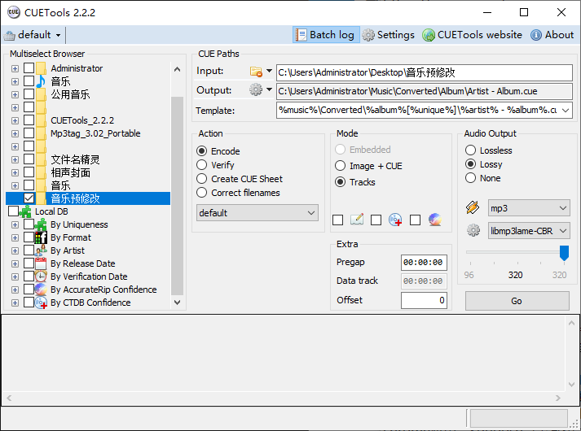
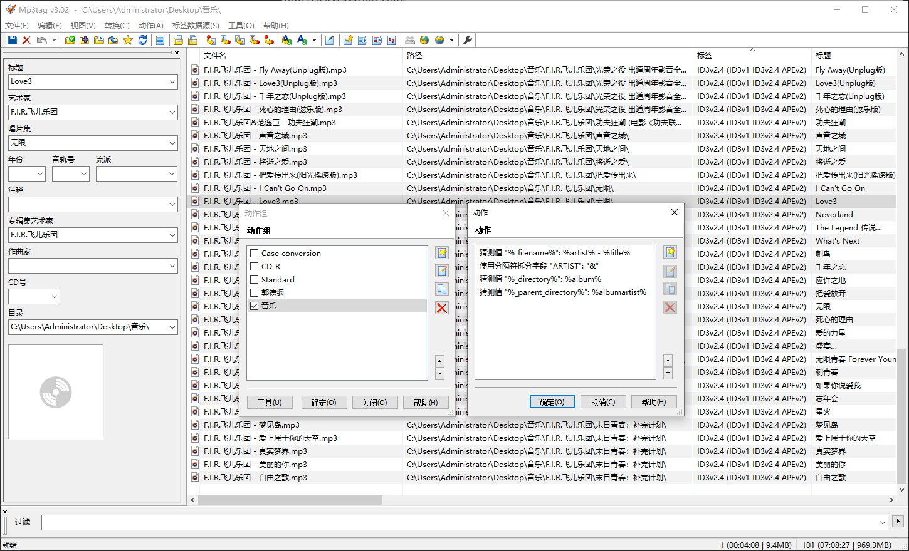

一直想听听歌，发现现在这些音频资源已经相当割裂了，就算把市面上的听歌软件都装上付了费，也没法舒服的听歌，有点丧心病狂了。狠下心自己搭建流媒体服务器，目前一期阶段已经完成了，特此记录下。

<!--more-->

## 前言
整个工程分成两部分，一大块为音频整理，这部分冗长耗时，而且我还踩了点坑；第二部分是技术支撑，没有什么难度。

## 音频整理
整个音乐媒体库结构可以参考Jellyfin教程，简而言之就是分三级：音频作者/专辑/音频文件、专辑封面。其中音频文件采用了320k采样的mp3，而且里面的title，artist，album，album_artist都是正确的，其余的tag全部清除掉。文件名则采用‘artist - title’格式保存。  

整理每一个歌手的资料大体有三个阶段：获取完整专辑音频mp3文件获取、修改文件名和mp3tag、放置正方形专辑cover。

### 获取完整专辑音频mp3文件获取
首先我先去查一查要整理的歌手成名曲，下载这些成名曲所在的专辑，其中很多专辑都是用wav、ape、flac整轨发布出来的，我们首先要下载到这些专辑。  

整轨的专辑要想拆分成每一首歌，并转换成mp3，需要两样东西，一个是整轨音频对应的cue音轨标记文件，一个是能帮咱们切割音轨转换音频格式的软件。所以一般下载下来的整轨专辑一般都至少会有音频和cue两个文件，此外比较完善的专辑资源还会有这个专辑的封面图、背面图、光盘图、宣传小册子扫描图等等。  

CUETools是一个专门用来分轨的软件，它可以将整轨的音频切割成一首首歌然后转换成mp3。更值得一提的是，这个软件可以直接分析rar和zip文件，而不需要用户解压后在进行分轨转换操作。

#### 很不幸没有这个专辑资源
如果很不幸这个专辑很新，或者非常冷门，我们只好下载每一首歌自己拼一个专辑，这就是我们常规下载mp3文件。然而最最不幸的是单曲的音频也下载不到，那么我们只能在youtube上查一查有没有对应的mv，然后用一些在线提取网站把这个音频提取出来。  
放屁音乐网：[https://www.fangpi.net/](https://www.fangpi.net/)  
音乐包：[https://www.gequbao.com/](https://www.gequbao.com/)  
多种品质下载：[http://tools.liumingye.cn/music/](http://tools.liumingye.cn/music/)  
musicenc：[https://www.musicenc.com](https://www.musicenc.com)  
Youtube转MP3：[https://ytmp3.nu/](https://ytmp3.nu/)   

### 修改文件名和mp3tag
修改文件名都是通过Mp3tag来实现的。一般来说，下载下来的音频专辑，不管分轨的还是整轨的，都会有一定的音频信息，它们包括每首歌的名称，歌手名，还有一些提供资源的网站留下的注释等等。我们首先利用这些已有的信息，将文件名改成咱们需要的‘artist - title’格式，如果有多位歌手，我们将用&符号分隔开（'$meta_sep(x,&)'）。  

接着我们删除所有的mp3tag信息，保证不存在无用的信息嵌在在音频文件中。最后就是按照文件名和文件结构重新生成tag。由于我们是严格按照‘专辑作者/专辑名称/音频文件、专辑封面’三级整理文件，那么音频文件的文件夹名一定是专辑名称，文件名一定包含title和歌手名，把这些重新写入到mp3音频文件里。

如果有了解的预置函数可以查询：[https://docs.mp3tag.de/scripting/](https://docs.mp3tag.de/scripting/)

#### 针对繁体文件名
文件名精灵，主要用来繁体变简体，去掉文件夹上的前几个后几个字符，试用版每次转换完前十个从列表里移除然后再次执行，可以凑合用。

### 放置正方形专辑cover
这个工作也一样琐碎，在各个网站获取资源（企鹅、云音乐、cool我、亚马逊）。
1. 高清大图封面（据说是从苹果Music拿的）：[https://i.oppsu.cn/](https://i.oppsu.cn/)  
2. chrome插件：图片另存为JPG/PNG/WebP  针对企鹅图片，默认是300x300，最大支持500x500
3. chrome插件：云音乐音乐封面下载  需要进入到某一首歌的页面邮件里才有保存选项，保存的是音乐封面原图，官网地址[https://cover.olook.me/](https://cover.olook.me/)
4. cool我音乐不要求登录，图片链接请求3000会返回服务器上最大的图
5. 在线Photoshop：[https://www.photopea.com/](https://www.photopea.com/)
6. chrome应用：Squoosh 离线图片压缩工具，类似tinypng

### 注意事项
我不建议把封面图嵌入mp3，有的图非常大，一个专辑十几首歌都保存相同的图，导致存储空间浪费，而且mp3tag处理起来也会慢上不少。

### 其他用到的网站
* 魔迷士音乐博客：[https://www.momishi.com/](https://www.momishi.com/)（已支付）
* 夕阳小站：[http://www.xyxz001.com/](http://www.xyxz001.com/)
* 我的打包分享：[http://mydbfx.com/](http://mydbfx.com/)
* 魔镜歌词网：[https://mojim.com/](https://mojim.com/)
* 音乐下载：[https://www.musicenc.com/](https://www.musicenc.com/)
* Youtube转MP3：[https://ytmp3.nu/](https://ytmp3.nu/)
* 学搜搜：[https://www.xuesousou.com/](https://www.xuesousou.com/)
* 城通慢速转直链：[https://ctfile.qinlili.bid/](https://ctfile.qinlili.bid/)
* 城通搜索：ct.vpan123.com（借助谷歌关键词搜索）
* 仓库：[https://www.cangkus.com/](https://www.cangkus.com/)
* 鑫巷子音乐酷：[http://www.yinleku.cn/](http://www.yinleku.cn/)
* 我天哪｜鸡哥：[https://www.wotianna.com/](https://www.wotianna.com/)