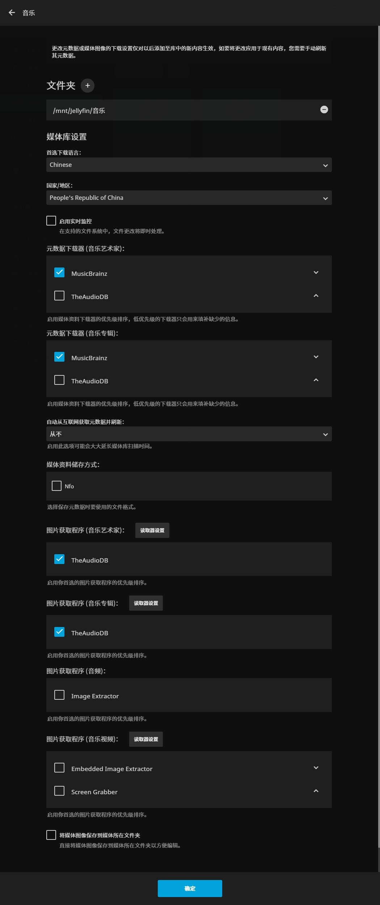

上一篇介绍了音频资料怎么收集整理，这一篇主要介绍Jellyfin的安装使用。

<!--more-->

## 预期目标
我能在任何有网络的环境下听任何歌，这个需要好多技术来支撑这个需求。
0. 一个能装ubuntu的低功耗主机
1. ddns，能把公网地址动态映射到域名上去，每次访问域名就可以访问到家里的机器
2. ufw，ubuntu自带的防火墙，只放行jellyfin端口到外网，其余需要的端口放行局域网
3. vnc，可以远程桌面到这个机器，机器没有显示器，查了一个假HDMI负载
4. ssh，终端远程连接用的
5. jellyfin，流媒体管理软件

## 环境配置
系统选择Ubuntu 20.04lts（不要用22版本，好多软件还不兼容，比如vnc、todesk），上面这些软件安装起来都很容易，其中jellyfin安装可以参考这篇教程：[How to install Jellyfin Media Server on Ubuntu 20.04 LTS](https://www.how2shout.com/linux/how-to-install-jellyfin-media-server-on-ubuntu-20-04-lts/)

## Jellyfin创建音乐资料库
这样的配置可以让Jellyfin使用我们在每个专辑文件夹预置的cover.jpg，而不是用网上下载的封面图替换本地的。

## 注意事项
Jellyfin的播放列表是绑定在音乐媒体库上的，媒体库和播放列表呈一对多关系，这意味着如果想欧美音乐和华语音乐分别保存为两个媒体库，那么两个库中的音乐不能同时出现在一个播放列表里。
